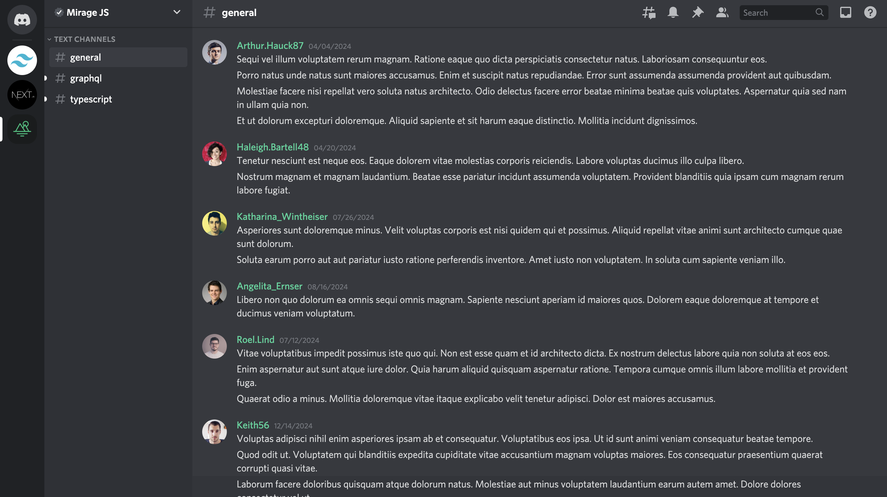

## Tailwind CSS - buildui

## Installation

- Install dependencies:
   npm install

- Start the development server:
   npm run dev

## Demo

## Acknowledgements

- Learned from the buildui course on Tailwind Mastery.
